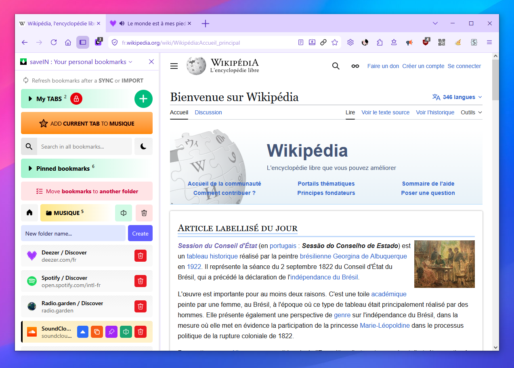

<h1>🦊 Classic Tabs for Firefox</h1>

- In this screenshot I use this theme [https://addons.mozilla.org/en-US/firefox/addon/whitewindow](https://addons.mozilla.org/en-US/firefox/addon/whitewindow)  
- The add-on in the SIDEBAR is **saveIN** available on [https://addons.mozilla.org/en-US/firefox/addon/savein/](https://addons.mozilla.org/en-US/firefox/addon/savein/)

## 💾 INSTALL

1. **Open** Firefox and type `about:config` in the address bar and press <kbd>Enter</kbd>

2. If a warning page appears, **click** `Accept the Risk and Continue` to access the `about:config` page

3. **Search** `toolkit.legacyUserProfileCustomizations.stylesheets` **and set it to** `true`

4. **Type** `about:support` in the address bar and press <kbd>Enter</kbd>

5. **Scroll down** to the `Profile Folder` section and **click** `Open Folder`

6. **Download** the `chrome` folder

7. **Put** `chrome` folder into your Firefox profile directory(5)

8. **Restart** Firefox to apply the changes

## 🎨 An other theme feel good with classic tabs
[https://addons.mozilla.org/en-US/firefox/addon/microsoft-windows-xp1](https://addons.mozilla.org/en-US/firefox/addon/microsoft-windows-xp1)
